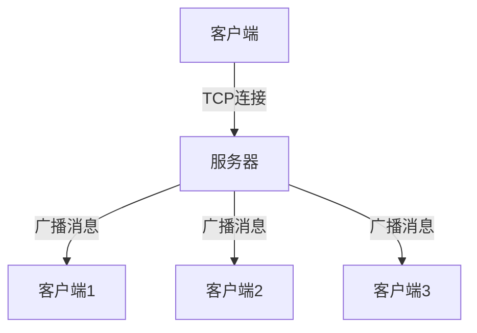

# Noface
- A Net chat room.
# Noface - Anonymous LAN Chat

## Overview
Lightweight C++ terminal chat system for LAN environments. No registration, no tracking.

## Features
- Anonymous messaging
- Multi-room support
- Cross-platform (Linux/macOS/Windows)
- Real-time communication

## Build
```bash
# Server
g++ -std=c++17 server.cpp -o noface_server -lpthread

# Client
g++ -std=c++17 client.cpp -o noface_client -lpthread
```

## Usage
1. Start server: `./noface_server 8080`
2. Join chat: `./noface_client <server_ip> 8080 <username>`
3. Type messages, `/exit` to quit

## Design
- Minimal dependencies
- Privacy-focused
- Easy to extend

## Roadmap
- End-to-end encryption
- File sharing
- Message history

---

# 终端匿名局域网聊天系统

## 项目概述

**终端匿名局域网聊天系统** 是一个基于C++开发的轻量级局域网即时通讯工具，允许用户在终端环境中通过局域网进行匿名聊天和群组交流。该系统完全使用标准C++实现，无需图形界面，适合在服务器、开发环境等终端场景使用。

## 功能特性

### 核心功能
- ✅ **局域网通信** - 通过TCP/IP协议在局域网内建立连接
- ✅ **多房间支持** - 用户可以创建或加入不同的聊天房间
- ✅ **匿名聊天** - 无需注册，连接即用
- ✅ **多用户支持** - 支持多个客户端同时连接

### 高级功能
- ✨ **用户标识** - 每个用户可设置临时用户名
- ✨ **系统消息** - 自动广播用户加入/离开通知
- ✨ **实时消息** - 消息即时发送和接收
- ✨ **跨平台** - 支持Linux/macOS/Windows系统

## 技术架构



### 组件说明
- **服务器**：消息中转中心，管理客户端连接和房间分发
- **客户端**：用户交互终端，发送和接收消息

## 编译与安装

### 系统要求
- C++17兼容编译器 (g++/clang/MSVC)
- Linux/macOS/Windows系统
- 局域网环境

### 编译步骤

```bash
# 编译服务器
g++ -std=c++17 server_enhanced.cpp -o server_enhanced -lpthread

# 编译客户端
g++ -std=c++17 client_enhanced.cpp -o client_enhanced -lpthread
```

### Windows额外步骤
```bash
# 使用MinGW编译时需要链接ws2_32库
g++ -std=c++17 client_enhanced.cpp -o client_enhanced -lws2_32
```

## 使用指南

### 启动服务器
```bash
./server_enhanced <端口号>
# 示例：./server_enhanced 8080
```

### 启动客户端
```bash
./client_enhanced <服务器IP> <端口号> <用户名>
# 示例：./client_enhanced 192.168.1.100 8080 Alice
```

### 客户端操作
1. 启动时输入要加入的房间名
2. 直接输入消息内容并按回车发送
3. 输入`/exit`退出程序

## 项目结构

```
terminal-chat-system/
├── server.cpp    # 服务器主程序
├── client.cpp    # 客户端主程序
├── README.md             # 项目文档
└── Makefile              # 编译脚本
```

## 设计理念

1. **轻量简洁** - 最小化依赖，仅使用标准库
2. **匿名优先** - 不收集任何用户信息
3. **低延迟** - 优化网络传输效率
4. **易扩展** - 模块化设计便于功能扩展

## 扩展计划

### 未来版本功能
- 端到端加密支持
- 文件传输功能
- 用户自定义命令系统
- 消息历史记录